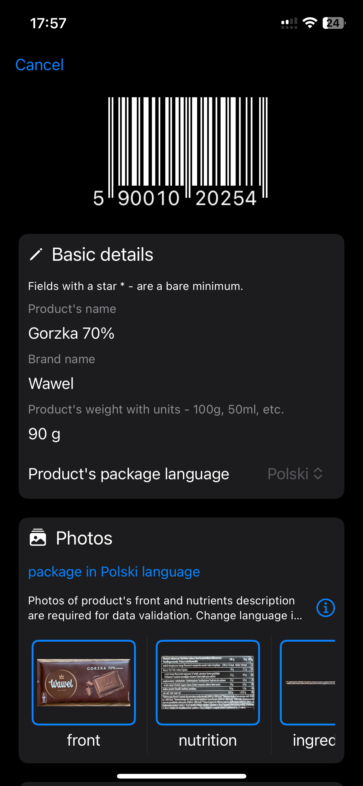
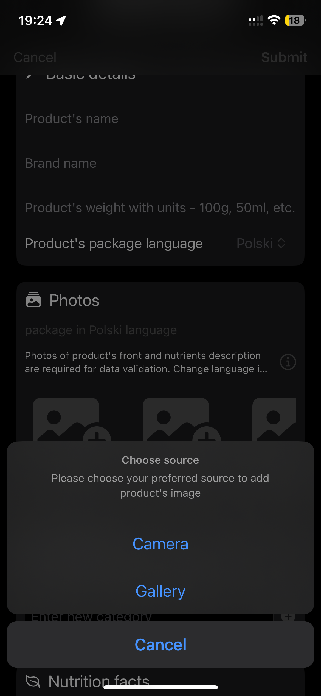
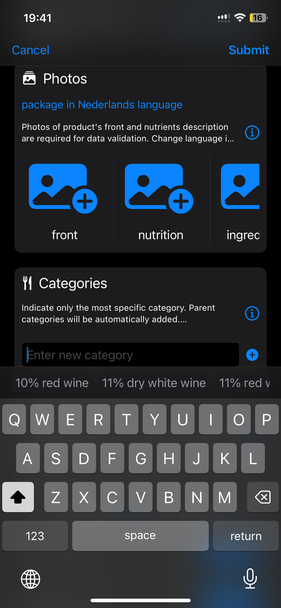
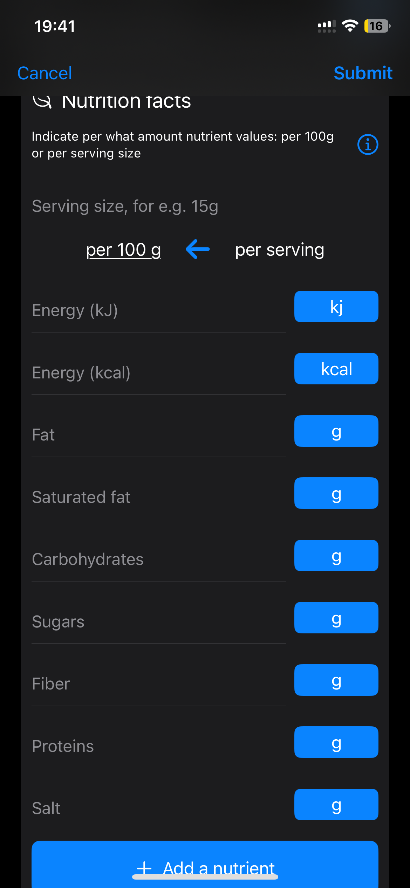
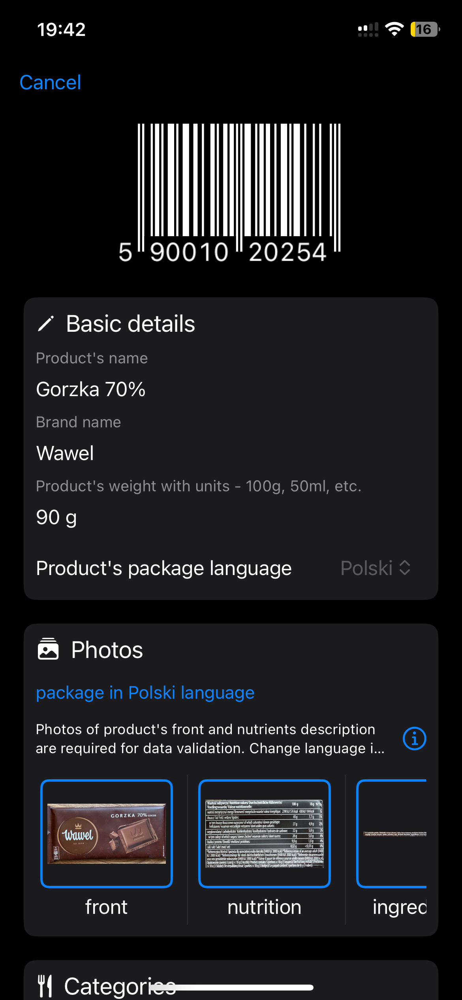
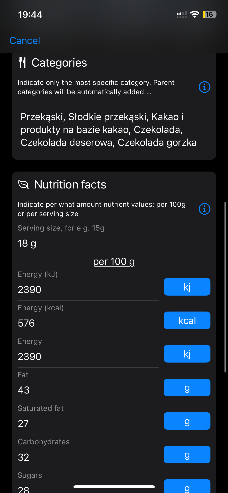

# openfoodfacts-swift


# Open Food Facts - Swift
Swift package for the Open Food Facts API. Easily access to more than 1.9 million products from all around the world.
Open Food Facts is powered by contributors from around the world and is constantly growing thanks to them.

## Compatibility

iOS 15+, verified compatibility only with Swift 5.9 for now

## Prerequisites

For adding product's pictures the SDK uses camera and gallery. App which integrates it should add NSCameraUsageDescription and NSPhotoLibraryUsageDescription.

## How to use ?
See `ExampleApp` for two scenarious of starting screen from scanning product or entering it manually

You can integrate the SDK into your iOS app using SPM (Swift Package Manager) by searching the repo using github's url

There are two modes for now: new and view

Sample codes:
existing 5900102025473 [pl] / 8711258029584 [nl], missing 5701377101134 [pl]

SDK has screen to view or submit product (in OFF's Product json "scheme")
```
ProductPage(barcode: barcode) { uploadedProduct in

}
```

### Submit new

|      |      |      |      |
|------|------|------|------|
|||||

### View existing

|      |      |      |
|------|------|------|
||||

Edit mode is in progress

### Open Food Facts config

All available settings are in class `OFFConfig`. Set them in your `AppDelegate` method `didFinishLaunchingWithOptions`

```
OFFConfig.shared.useRequired = false
OFFConfig.shared.apiEnv = .staging
OFFConfig.shared.country = OpenFoodFactsCountry.POLAND
OFFConfig.shared.productsLanguage = OpenFoodFactsLanguage.DUTCH
OFFConfig.shared.userAgent = UserAgent(name: "AgentName", version: "1.0", system: "iOS", comment: "Some comment")
OFFConfig.shared.globalUser = User(userId: "<YOUR_USERNAME>", password: "<PASSWORD>")
```

`.useRequired` - this flag indicates bare minimum about product, its photos and nutriments (In Progress). It makes base validation for you and shows missing by user fields before sending product, set to false to ommit any validation

`.apiEnv` - `.staging/.production` switch between testing environment `world.openfoodfacts.net` and production `world.openfoodfacts.org`

`.productsLanguage` - you can present product's language if you know it, although editor has picker for it

`country` - you can preset country (In progress)

Autogenerated or use your own description of user agent if you want to personalise instance of app which make READ/WRITE requests to API
```
OFFConfig.shared.UserAgent(name: "AgentName", version: "1.0", system: "iOS", comment: "Some comment")
```

Production environment requires user created at `world.openfoodfacts.org`, staging uses `off/off`
```
OFFConfig.shared.globalUser = User(userId: "<YOUR_USERNAME>", password: "<PASSWORD>")
```

Editor/Viewer for barcode
```
ProductPage(barcode: self.$barcode, isPresented: self.$isProductEditorPresent, submitProduct: $submitProduct)
```


### Notes
You may skip the following parameters in case of:
1. For staging environment default user if `off/off`
2. UserAgent is autogenerated using plist env properties like `CFBundleName/CFBundleShortVersionString/CFBundleVersion` and device's UUID

## Third party dependencies

See NOTICE with all dependencies of OpenFoodFactsSDK and their licensing

## General principles
- You can look for information about products, including many useful computed values. 
- If you can't get the information on a specific product, you can get your user to send photos and data, that will then be processed by Open Food Facts AI and contributors to get the computed result you want to show them.
- You can also implement the complete flow so that they get immediately the result with some effort on their side.

## Contributing 

### If your users do not expect a specific result immediately (eg. Inventory apps)
- Send photos (front/nutrition/ingredients/packaging): most painless thing for your users
- The Open Food Facts AI Robotoff will generate some derived data from the photos
- Overtime, other apps, and the Open Food Facts community will fill the data gaps

### If your users do expect a result immediately (eg Nutrition apps, Scoring apps…):
- Send nutrition facts + category > get the Nutri-Score
- Send ingredients > get the NOVA group (about food ultra-processing), additives, allergens, normalized ingredients, vegan, vegetarian…
- Send category (strict minimum) + labels + origins of ingredients + packaging (photo and text) > get the Eco-Score (about environmental impact)

## Open Data Licence
The database in under the OdBL. This means attributing the source and also contributing back any additions (photos, data), which this package makes easy to do.
You can check the terms of use here : [Terms of use](https://world.openfoodfacts.org/terms-of-use).

## Using this SDK and Third party applications

- If you use this SDK, feel free to open a PR to add your application in the list in [REUSERS.md](https://github.com/openfoodfacts/openfoodfacts-swift/blob/develop/REUSERS.md)
- Make sure you comply with the OdBL licence, mentioning the Source of your data, and ensuring to avoid combining non free data you can't release legally as open data. Another requirement is contributing back any product you add using this SDK.

If you use this SDK, Feel [free to open a PR to add your application in this list](https://github.com/openfoodfacts/openfoodfacts-swift/edit/main/README.md).

## Authors
## Contributors

[](https://github.com/openfoodfacts/openfoodfacts-swift/graphs/contributors)
